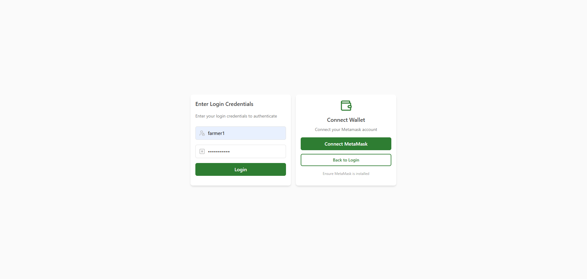

# Blockchain for product tracking
Designing blockchain model for agriculture product tracking involves using the inherent characteristics of blockchain - decentralisation, immutability and transparency - to track agricultural products through every stage of their lifecycle. This can include everything from production, processing, transportation, and distribution, to retail. Below are the essential details for building such a blockchain system.

<h5 align="center"> Home page </h5>


<h5 align="center"> Authentification page </h5>



# Table of content
- [Prérequis / Prerequisite](#prérequis--prerequisite)
- [Installation](#installation)
- [Use Case Definition](#use-case-definition)
- [Core Components of the Blockchain System](#core-components-of-the-blockchain-system)

## Prérequis / Prerequisite
- Nodejs
- npm

## Installation
**1. Clone repository** 
```
git clone https://github.com/SOSANE/agriculture-product-tracking-chain
cd agriculture-product-tracking-chain
```

**2. Install dependencies** 
```
npm install
```

## Use Case Definition
- **Objective** : Track and verify the authenticity and origin of agriculture products to enhance food safety, improve traceability, increase transparency in the supply chain, and reduce fraud.
- **Stakeholders** : 
    - Farmers/Producers
    - Processors (e.g. packaging, refining)
    - Distributors
    - Retailers
    - Consumers
    - Regulators/Certifiers

## Core Components of the Blockchain System
***Smart contracts***
Smart contracts will automate the key processes in the supply chain. For example :
- **Smart contract for certification** : Automatically trigger product certifications once certain conditions are met (e.g. product tested for pesticide levels).
- **Payment automation** : Automatically release payments between parties when products pass checkpoints in the suppply chain.
- **Product verification** : Confirm that the right agricultural product is moving through the supply chain in compliance with predefined standards.


--> For now using mock data only