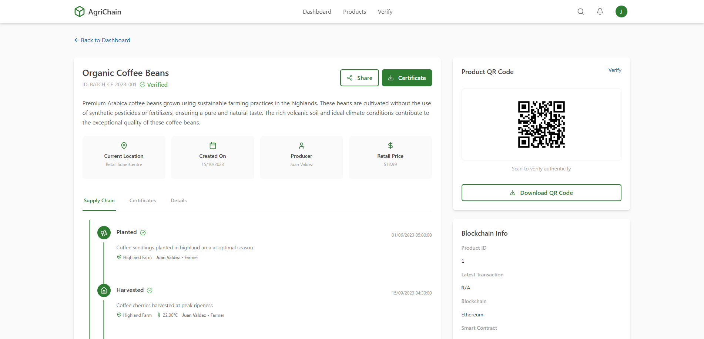

# *AgriChain* : Blockchain for product tracking

[](LICENSE)

A decentralized solution for tracking agricultural products through their lifecycle using blockchain technology.

Designing blockchain model for agriculture product tracking involves using the inherent characteristics of blockchain - decentralisation, immutability and transparency - to track agricultural products through every stage of their lifecycle. This include everything from production, processing, transportation, and distribution, to retail. Below are the essential details for building such a blockchain system.

**May 2025**
- mock data in analytics (for now)
- lotss of re-used code especially with the dashboard : so need to generalize with common components (greetings, metrics, quickActions)
- implement next : smart contracts, fix routing + more protected routing, role-specific functionalities, qr scanner, actual metamask wallet connection

<h5 align="center"> Home page </h5>


<h5 align="center"> Authentification page </h5>


<h5 align="center"> Dashboard </h5>


<h5 align="center"> Product details (ProductID: 1) </h5>



## Table of Contents
- [Features](#features)
- [Project Structure](#project-structure)
- [Prerequisites](#prerequisites)
- [Setup Guide](#setup-guide)
- [Running the System](#running-the-system)
- [Test Accounts](#test-accounts)
- [License](#license)

## Features
- Role-based authentication (Admin, Farmer, Processor, Distributor, Retailer, Regulator)
- Product traceability with blockchain verification
- PostgreSQL database backend
- React frontend dashboard

## Project Structure
```
agriculture-product-tracking-chain/
├── agrichain-backend/ # Node.js API server (port 5000)
├── agrichain-database/ # PostgreSQL schemas and scripts
├── agrichain-frontend-react/ # React Vite frontend (port 5173)
└── agrichain-smartcontract/ # Future smart contracts
```

## Prerequisites
- Node.js v18+
- npm v9+
- PostgreSQL 15+ (running on port 5432)
- Git

## Setup Guide
### 1. Clone Repository
```bash
git clone https://github.com/SOSANE/agriculture-product-tracking-chain
cd agriculture-product-tracking-chain
```

### 2. Backend Setup
```bash
cd agrichain-backend
npm install
cp .env.example .env
```

**Edit .env**: 
```dotenv
PORT=5000
DB_USER=postgres
DB_HOST=localhost
DB_NAME=agrichain
DB_PASSWORD=your_postgres_password
DB_PORT=5432
SESSION_SECRET=your_session_secret
```

### 3. Database Setup
1. Initialize the database:

First, run ``agrichain-database/init.sql`` file to create database

Then run the following line in project folder:
```bash
psql -U postgres -d agrichain -f ./agrichain-database/commands/schema.sql
```

### 4. Frontend Setup
```bash
cd ../agrichain-frontend-react/agrichain-frontend
npm install
npm run build
```

## Running the System
### 1. Start Backend:
```bash
cd agrichain-backend
npm start
```
### 2. Start Frontend:
```bash
cd ../agrichain-frontend-react/agrichain-frontend
npm run dev
```

Access: http://localhost:5173

## Test Accounts
| Role        | Username     | Password      |
|-------------|--------------|---------------|
| Admin       | admin        | admin123      |
| Farmer      | farmer1      | password123   |
| Farmer      | farmer2      | password123   |
| Farmer      | farmer3      | password123   |
| Farmer      | farmer4      | password123   |
| Regulator   | regulator1   | securepass    |
| Regulator   | regulator2   | securepass    |
| Regulator   | regulator3   | securepass    |
| Processor   | processor1   | process123    |
| Processor   | processor2   | process321    |
| Distributor | distributor1 | distribute123 |
| Distributor | distributor2 | distribute321 |
| Retailer    | retailer1    | retail123     |

## Licence
MIT © 2025 AgriChain