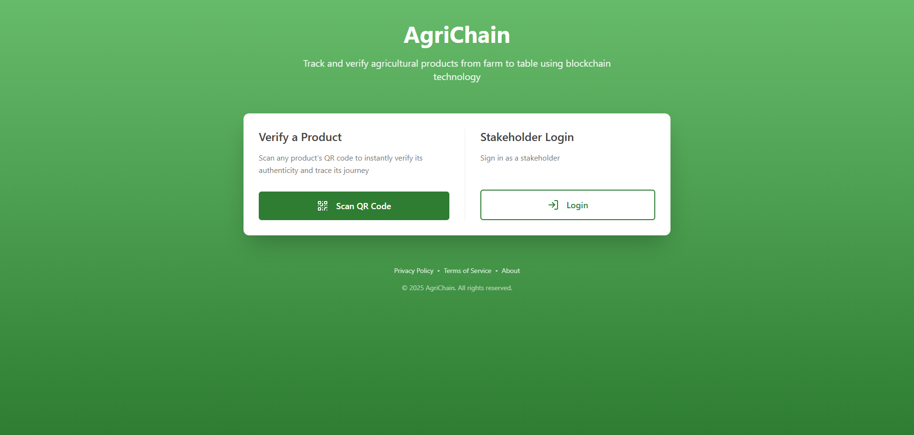
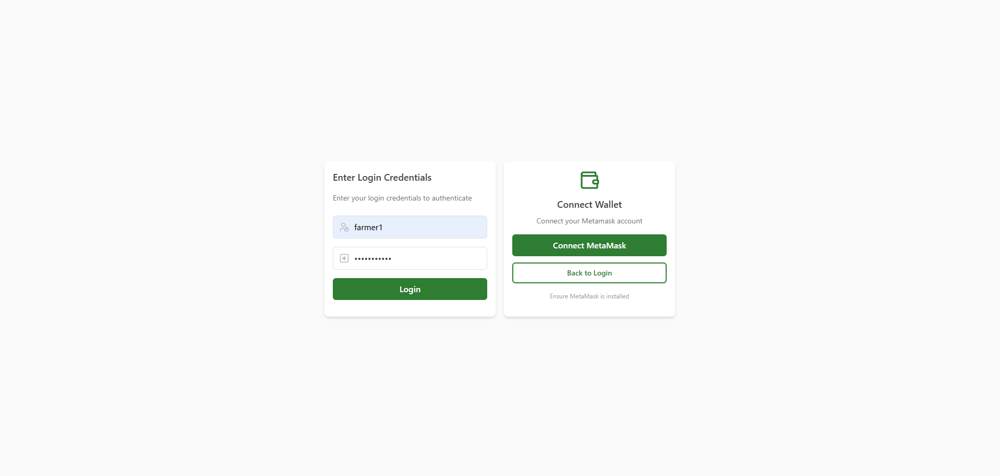
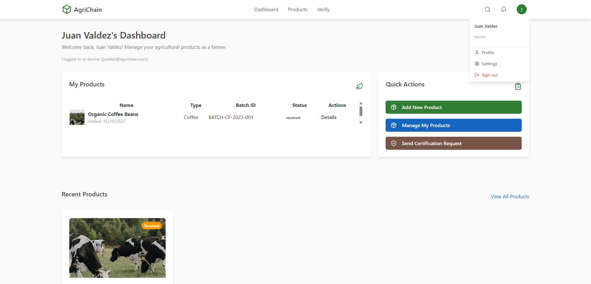
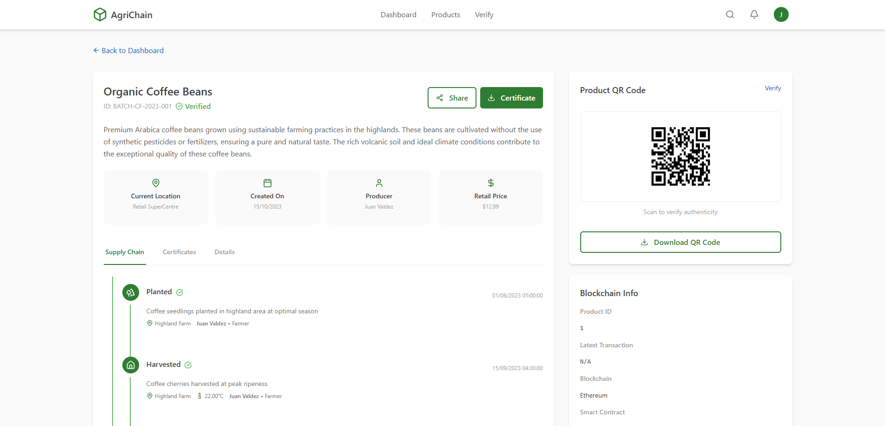

# *AgriChain* : Product Tracking and Identification in the Supply Chain Using Blockchain Technology
<h5 align="center"> A decentralized solution for tracking agricultural products through their lifecycle using blockchain technology. </h5>

[](LICENSE)

The product tracking and identification in the supply chain that uses blockchain technology, the ethereum network, smart contracts and QR codes to provide transparency and security and promote decentralisation.

Designing blockchain model for agriculture product tracking involves using the inherent characteristics of blockchain - decentralisation, immutability and transparency - to track agricultural products through every stage of their lifecycle. This include everything from production, processing, transportation, and distribution, to retail.

**NOTES: July 2025**
- dockerisation du projet dans [branche docker-configuration](https://github.com/SOSANE/agriculture-product-tracking-chain/tree/docker-configuration)

<h2 align="center"> App showcase </h2>
<h5 align="center"> Home page </h5>


<h5 align="center"> Authentification page </h5>


<h5 align="center"> Dashboard </h5>


<h5 align="center"> Product details (ProductID: 1) </h5>



## Table of Contents
- [Features](#features)
- [Project Structure](#project-structure)
- [Prerequisites](#prerequisites)
- [Docker Configuration (in work)](#docker-configuration-in-work)
- [Setup Guide](#setup-guide)
- [Running the System](#running-the-system)
- [Test Accounts](#test-accounts)
- [License](#licence)

## Features
- **QR codes** are used by the system to promote product authenticity. Scan a QR code to verify the history, origin and information of a product by fetching supply chain information in the Ethereum's decentralized database.
- Product traceability with **blockchain verification** using the **Ethereum network** via **Hardhat** and **smart contracts**.
- **PostgreSQL** used for database backend.
- **React** frontend dashboard for the web interface.

## Project Structure
```
agriculture-product-tracking-chain/
├── agrichain-backend/ # Node.js API server (port 5000)
├── agrichain-database/ # PostgreSQL schemas and scripts
├── agrichain-frontend-react/ # React Vite frontend (port 5173)
└── agrichain-smartcontract/ # Smart contracts & deployement scripts
```

## Prerequisites
- Node.js v18+
- npm v9+
- PostgreSQL 15+ (running on port 5432)
- Git
- Hardhat 2.23.0+
- Ethers/Ethers.js
- Solidity
- Docker (in progress)

## Docker Configuration (in progress)
1. Navigate to root project
2. Run 
```sh
docker compose up --build
```

## Setup Guide
### 1. Clone Repository
```bash
git clone https://github.com/SOSANE/agriculture-product-tracking-chain
cd agriculture-product-tracking-chain
```

### 2. Contract Setup
1. **Create a [MetaMask](https://portfolio.metamask.io/)** wallet if you do not own one.
2. **Download the [Metamask's browser extension](https://metamask.io/download)** and connect your wallet.
3. Run the following lines in project folder:
```bash
cd ./agrichain-smartcontract
npm install
npx hardhat compile           # Compile Agrichain contract
```
### 3. Backend Setup
Run in project folder:
```bash
cd ./agrichain-backend
npm install
cp .env.example .env
```

**Edit .env**:
```dotenv
PORT=5000
DB_USER=your_postgres_username
DB_HOST=localhost
DB_NAME=agrichain
DB_PASSWORD=your_postgres_password
DB_PORT=5432
CORS_ORIGIN=http://localhost:5173
SESSION_SECRET=your_session_secret
CONTRACT_ADDRESS=your_deployed_address
ADMIN_PRIVATE_KEY=your_private_admin_key
BLOCKCHAIN_PROVIDER_URL=http://localhost:8545
```
**PS. ``CONTRACT_ADDRESS`` and ``ADMIN_PRIVATE_KEY`` parameters can be obtained by starting a node and executing the initial script to deploy the contract in [3. Start contract](#3-start-contract). For now, both parameters can stay the way they are.**
### 4. Database Setup
1. **Initialize the database:**

First, run ``agrichain-database/init.sql`` file to create database.

2. **Execute ``./agrichain-database/commands/schema.sql`` in ``agrichain`` table:**

Then, run the following line in project folder:
```bash
psql -U postgres -d agrichain -f ./agrichain-database/commands/schema.sql
```

### 5. Frontend Setup
**Edit .env**:
```dotenv
VITE_ADMIN_PRIVATE_KEY=your_private_admin_key    # Can be obtained after starting hardhat node
VITE_CONTRACT_ADDRESS=your_deployed_address      # Contract address can be obtained by running scripts/deploy.js
VITE_BLOCKCHAIN_PROVIDER_URL=http://localhost:8545
```
**PS. Same message as in [3. Backend Setup](#3-backend-setup).**

Run in project folder:
```bash
cd ./agrichain-frontend-react/agrichain-frontend
npm install
npm run build
```

## Running the System
Run each step  in different terminals.
### 1. Start Backend:
Run in project folder:
```bash
cd ./agrichain-backend
npm start
```
### 2. Start Frontend:
Run in project folder:
```bash
cd ./agrichain-frontend-react/agrichain-frontend
npm run dev
```
### 3. Start contract:
- ``CONTRACT_ADDRESS`` can now be obtained after running ``scripts/deploy.js``.
- ``ADMIN_PRIVATE_KEY`` can now be obtained after starting the hardhat node.

To do that, run the following lines in project folder:
```bash
cd ./agrichain-smartcontract
npx hardhat node                                      # Start node
```
In a second terminal:
```bash
cd ./agrichain-smartcontract
npx hardhat run scripts/deploy.js --network localhost # Execute initial scripts and deploy contract
```
- Hardhat gives 20 accounts with their private keys, each account have a wallet with 10000 ETH (Testnet). **PS. All hardhat accounts and their private keys are PUBLIC INFORMATION. For example, account #0's address is always``0xf39fd6e51aad88f6f4ce6ab8827279cfffb92266``** → ***[Read more on Harhat (docs)](https://hardhat.org/hardhat-network/docs/overview)***
- For testing purposes (transactions), import 1-3 account to Metamask wallet using any of the hardhat private keys by adding a **personal network with the following parameters:**
  - **Local network**: ``http://localhost:8545/``
  - **Chain ID**: ``1337``
  - **Currency symbol**: ``ETH``
- One of the imported accounts' private key can be used for the ``ADMIN_PRIVATE_KEY``
- ``CONTRACT_ADDRESS`` & ``ADMIN_PRIVATE_KEY``'s values can now be replaced in the ``.env`` files.
- *May* need to [restart the system](#running-the-system) because some parameters changed.

***Application can now be accessed on: http://localhost:5173***

## Test Accounts
Several accounts pre-made for testing purposes:

| Role        | Username     | Password      |
|-------------|--------------|---------------|
| Admin       | admin        | admin123      |
| Farmer      | farmer1      | password123   |
| Farmer      | farmer2      | password123   |
| Farmer      | farmer3      | password123   |
| Farmer      | farmer4      | password123   |
| Regulator   | regulator1   | securepass    |
| Regulator   | regulator2   | securepass    |
| Regulator   | regulator3   | securepass    |
| Processor   | processor1   | process123    |
| Processor   | processor2   | process321    |
| Distributor | distributor1 | distribute123 |
| Distributor | distributor2 | distribute321 |
| Retailer    | retailer1    | retail123     |


## Licence
MIT © 2025 AgriChain
